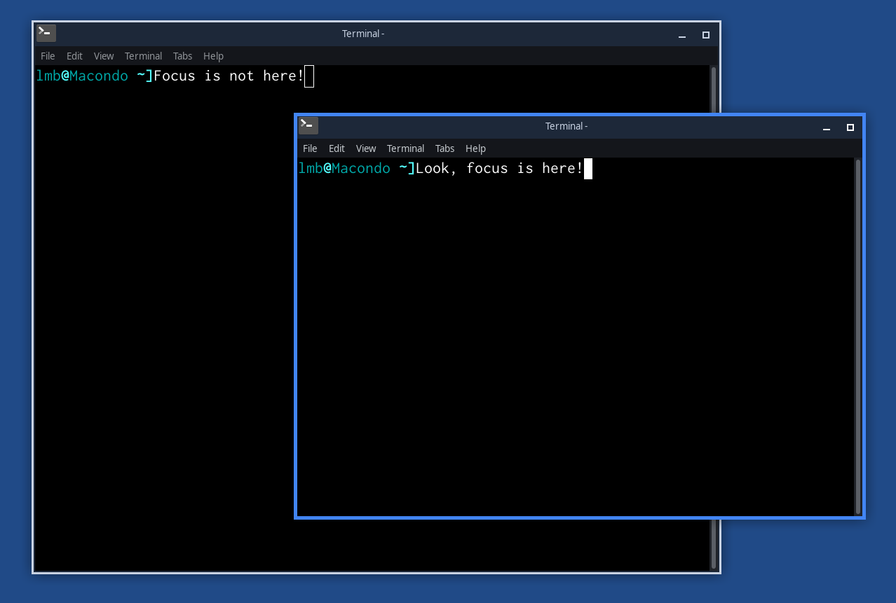

# What Comes Around (Goes Around)

In the good old times windows had distinct borders around them. As of 2021, the
trend seems to be an exaggerated form of minimalism that make it very hard to
see where one window ends and the next one starts. Borders are hard to see.
Everything blends together into a beautiful, confusing rectangle of sameness.

*What Comes Around (Goes Around)* is a XFCE 4 theme that has distinct borders
and matches my tastes in general.

*What Comes Around (Goes Around)* is based on the quite nice [*OneColor XFCE*
theme by novomente](https://www.xfce-look.org/p/1148918/) (that's why it is
licensed under the GNU GPL, which I think is an odd license for a theme).

## How do I install it?

[RTFM](https://wiki.xfce.org/howto/install_new_themes).

## Colors

For the lack of a better place to store this information, these are the main
colors I used in the theme:

* Base blue: #4285F4
* Dark blue: #1d2839
* Light blue: #c9d3e3
